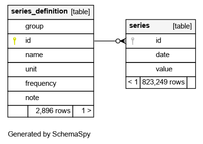

# Create a Database and Data Service Containing RBNZ Statistics

Data on the [Reserve Bank of New Zealand](https://www.rbnz.govt.nz/statistics) website can be a little awkward to source and use, painfully so for those who wish to automate the process.  First, all data is stored in Excel spreasheets which aren't directly machine readable.  But even then, the data isn't easily used because the files themselves, due to the way they're hosted, cannot be directly downloaded in tools such as R or Python, or common clients such as `curl` and `wget`.  For example, the following R command will fail outright:

```r
download.file(
  "https://www.rbnz.govt.nz/-/media/project/sites/rbnz/files/statistics/series/b/b1/hb1-daily.xlsx",
  "hb1-daily.xlsx"
)
```

On top of this, these files are also subject to some pretty severe [terms of use](https://www.rbnz.govt.nz/about-our-site/terms-of-use).  Users are required to get written permission for any automation, and even then must not perform more than 1 GET per minute!  There are 115 files listed on the website, totalling 8MB all up.  **These terms mean users are required to take 2 hours to download 8MB of data**!  The Reserve Bank could simplify things for their users considerably simply by placing all these files in a single zip file and making it available via a single stable link that could be fetched via common clients such as wget and cURL... Azure BLOB storage, and S3 bucket... anything, really.  But in lieu of that...

This repo includes a simple(-ish) Scala library which has entry-points which:

* download all Excel files listed on the [Statistical series data files page](https://www.rbnz.govt.nz/statistics/series/data-file-index-page)
* import _most_ Excel files and output as a SQLite database
* run a basic data service on top of the resulting SQLite database.

Excel files will successfully import if they:

* have a tab named `Data`
* have a tab named `Series Definitions`
* data in `Data` tab must start in row 6, with series IDs in row 5
* `Series Definitions` tab must have 5 columns with header row.

The resulting database is simple, with the following schema:




## Build

It is assumed users have [sbt](https://www.scala-sbt.org/).  All that is required to build the library is to run the following command:

```bash
sbt assembly
```

This will yield the following artefact:

```plaintext
target/scala-2.13/rbnz.jar
```

## Selenium / Chrome / Chromedriver

The program uses Selenium webdriver, and assumes Chrome and [chromedriver](https://chromedriver.chromium.org/) are available, and working correctly.  One easy way to ensure this is the case is to use Docker, and a sufficient `Dockerfile` is provided.

## Using the Library with Docker

Users first need to build the docker image:

```bash
docker build -t rbnz .
```

(Note that `sbt assembly` must have been run previously, so that `target/scala-2.13/rbnz.jar` exists.)

### Download Data

To download all the Excel files to a local directory (make sure you create `${PWD}/data` first, and that _you_ own it, or you're going to have a bad time :)):

```bash
docker run --rm \
  -u $(id -u):$(id -g) \
  -v ${PWD}/data:/data rbnz \
  org.cmhh.DownloadData data
```

At the time this was written, this was roughly 120 files, totalling only 9.5 MB, or 8.1MB zipped.  While this is a small amount of data, the download does pause for around 5 seconds between each file so as not to add any real pressure to the remote server.  This does mean the data can take a few minutes to download, however.

### Create Database 

We can create a SQLite database as follows:

```bash
docker run --rm \
  -u $(id -u):$(id -g) \
  -v ${PWD}/data:/data -v ${PWD}/output:/output \
  rbnz org.cmhh.CreateDatabase output/rbnz.db
```

If files already exist in `${PWD}/data`, they will not be downloaded again.  To get updated files, either clear the folder, or mount a different, empty folder.

### Run Data Service

Finally, to run the service:

```bash
docker run -td --rm \
  -v ${PWD}/output:/output \
  -p 9001:9001 \
  rbnz org.cmhh.Service output/rbnz.db
```

or, just:

```bash
docker compose up
```

The data service is simple, with just two end-points:

* `/rbnz/definition` - list available series IDs
* `/rbnz/series` - list all observations for requested series

Each end-point takes 3 arguments:

* `id` - series ID, optional, repeating
* `groupKeyword` - search for text in group name, optional, repeating
* `nameKeywork` - search for text in name, optional, repeating.

For example, `GET`ting:

```plaintext
http://localhost:9001/rbnz/definition?groupKeyword=Exchange&nameKeyword=European
```

yields

```json
[
    {
        "group": "Exchange rates (quoted per NZ$)",
        "id": "EXR.DS11.D03",
        "name": "European euro",
        "unit": "NZD/EUR",
        "frequency": "D",
        "note": null
    },
    {
        "group": "Exchange rates (quoted per NZ$)",
        "id": "EXR.MS11.D03",
        "name": "European euro",
        "unit": "NZD/EUR",
        "frequency": "M",
        "note": null
    }
]
```
 
The service uses a single SQLite connection, though it would be easy enough to add some sort of connection pool, but is nevertheless reasonably fast.  For example:

```bash
$ siege -t 10s -c 4 "http://localhost:9001/rbnz/series?id=EXRT.MR41.NZB17"
```
```plaintext
** SIEGE 4.0.7
** Preparing 4 concurrent users for battle.
The server is now under siege...
Lifting the server siege...
Transactions:                   3222 hits
Availability:                 100.00 %
Elapsed time:                   9.91 secs
Data transferred:              34.08 MB
Response time:                  0.01 secs
Transaction rate:             325.13 trans/sec
Throughput:                     3.44 MB/sec
Concurrency:                    3.97
Successful transactions:        3222
Failed transactions:               0
Longest transaction:            0.06
Shortest transaction:           0.00
```

It's a little slower for larger series, but still reasonable.  `EXRT.DS41.NZB17`, for example, has 5860 or so observations, and it is returned in about 15 milliseconds.  

```bash
$ siege -t 10s -c 2 "http://localhost:9001/rbnz/series?id=EXRT.DS41.NZB17"
```
```plaintext
** SIEGE 4.0.7
** Preparing 2 concurrent users for battle.
The server is now under siege...
Lifting the server siege...
Transactions:                    482 hits
Availability:                 100.00 %
Elapsed time:                   9.10 secs
Data transferred:              50.95 MB
Response time:                  0.04 secs
Transaction rate:              52.97 trans/sec
Throughput:                     5.60 MB/sec
Concurrency:                    1.99
Successful transactions:         482
Failed transactions:               0
Longest transaction:            0.14
Shortest transaction:           0.02
```

Users could then write wrappers in other languages.  For example, using R we can plot the daily TWI easily enough:

```r
library(jsonlite)

twi <- jsonlite::fromJSON(
  "http://localhost:9001/rbnz/series?id=EXRT.DS41.NZB17", 
  simplifyDataFrame = FALSE
)

plot(
  twi[[1]]$date |> as.Date(), 
  sapply(twi[[1]]$value, \(x) if (is.null(x)) NA else x), 
  type = "l", 
  xlab = "date", ylab = twi[[1]]$unit,
  main = sprintf("%s, %s", twi[[1]]$group, twi[[1]]$name)
)
```


Of course, it is easy enough to use the SQLite database directly from most analytical tools.  For R:

```r
library(RSQLite)
library(ggplot2)

conn <- DBI::dbConnect(
  RSQLite::SQLite(), 
  "~/Projects/rbnz/output/rbnz.db"
)

twi <- DBI::dbGetQuery(
  conn, 
  "select * from series where id = 'EXRT.DS41.NZB17'"
)

twi_def <- DBI::dbGetQuery(
  conn,
  "select * from series_definition where id = 'EXRT.DS41.NZB17'"
)

DBI::dbDisconnect(conn)

ggplot(data = twi, aes(x = as.Date(date), y = value)) +
  geom_line() +
  ggtitle(sprintf("%s, %s", twi_def$group, twi_def$name)) +
  xlab("date") +
  ylab(twi_def$unit)
```

