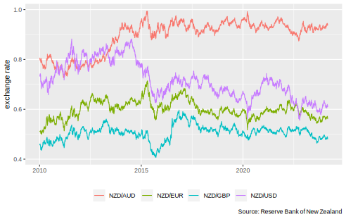

# Create a Database and Data Service Containing RBNZ Statistics

**Note** it is against the Reserve Bank's [terms of use](https://www.rbnz.govt.nz/about-our-site/terms-of-use) to use an automated agent without permission.

This repo includes a simple(-ish) Scala library which has entry-points which:

* download all Excel files listed on the [Statistical series data files page](https://www.rbnz.govt.nz/statistics/series/data-file-index-page)
* import _most_ Excel files and output as a SQLite database
* run a basic data service on top of the resulting SQLite database.

Excel files will successfully import if they:

* have a tab named `Data`
* have a tab named `Series Definitions`
* data in `Data` tab must start in row 6, with series IDs in row 5
* `Series Definitions` tab must have 5 columns with header row.

The resulting database is simple, with the following schema:


## Build

It is assumed users have [sbt](https://www.scala-sbt.org/).  All that is required to build the library is to run the following command:

```bash
cd rbnz
sbt assembly
```

This will yield the following artefact:

```plaintext
./rbnz/target/scala-2.13/rbnz.jar
```

## Selenium / Chrome / Chromedriver

The program uses Selenium webdriver, and assumes Chrome and [chromedriver](https://chromedriver.chromium.org/) are available, and working correctly.  One easy way to ensure this is the case is to use Docker, and a sufficient `Dockerfile` is provided.  See below.

## Run

The jar file lets users do several things:

* download all Excel files
* create a SQLite database from downloaded Excel files
* run a basic data service on top of the SQLite database

To download Excel files:

```bash
java -cp rbnz/target/scala-2.13/rbnz.jar \
  org.cmhh.DownloadData \
  --download-dir downloads 
```

To create a SQLite database:

```bash
java -cp rbnz/target/scala-2.13/rbnz.jar \
  org.cmhh.CreateDatabase \
  --download-dir downloads \
  --database-path output/rbnz.sqlite 
```

Finally, to start a data service:

```bash
java -cp rbnz/target/scala-2.13/rbnz.jar \
  org.cmhh.Service --database-path output/rbnz.sqlite
```

## Docker

All of the above steps (building a jar, downloading data, creating a database, and running a service) can be done via Docker, and a docker compose setup is provided for each step.  **Note** that Docker containers will not typically run as root, and expect `GID` and `UID` environment variables to be set.  To create an appropriate `.env` file, run the `env.sh` script.

### Build

A basic docker compose setup is supplied which can be used to build `rbnz.jar`.  This is useful for those who do not have sbt or the JDK on their systems, and don't want to install either.  To create the `rbnz.jar`:

```bash
docker compose -f build_jar.yml up -d
```

### Download Data

To download data:

```bash
docker compose -f download.yml up -d
```

### Create Database

To create a database:

```bash
docker compose -f create_database up -d
```

### Run Service

To run a data service:

```bash
docker compose -f service.yml up -d
```

The service will be running on port 9002.  The data service is simple, with just two end-points:

* `/rbnz/definition` - list available series IDs
* `/rbnz/series` - list all observations for requested series

Each end-point takes 3 arguments:

* `id` - series ID, optional, repeating
* `groupKeyword` - search for text in group name, optional, repeating
* `nameKeyword` - search for text in name, optional, repeating.
* `frequency` - series frequency--one of `D`, `M`, `A`
* `minDate` - minimum date for result set

For example, `GET`ting:

```plaintext
http://localhost:9002/rbnz/definition?groupKeyword=Exchange&nameKeyword=European
```

yields

```json
[
    {
        "group": "Exchange rates (quoted per NZ$)",
        "id": "EXR.DS11.D03",
        "name": "European euro",
        "unit": "NZD/EUR",
        "frequency": "D",
        "note": null
    },
    {
        "group": "Exchange rates (quoted per NZ$)",
        "id": "EXR.MS11.D03",
        "name": "European euro",
        "unit": "NZD/EUR",
        "frequency": "M",
        "note": null
    }
]
```
 
The service uses a single SQLite connection (though it would be easy enough to add some sort of connection pool) but is nevertheless reasonably fast.  For example:

```bash
$ siege -t 10s -c 4 "http://localhost:9001/rbnz/series?id=EXRT.MR41.NZB17"
```
```plaintext
** SIEGE 4.0.7
** Preparing 4 concurrent users for battle.
The server is now under siege...
Lifting the server siege...
Transactions:                   3222 hits
Availability:                 100.00 %
Elapsed time:                   9.91 secs
Data transferred:              34.08 MB
Response time:                  0.01 secs
Transaction rate:             325.13 trans/sec
Throughput:                     3.44 MB/sec
Concurrency:                    3.97
Successful transactions:        3222
Failed transactions:               0
Longest transaction:            0.06
Shortest transaction:           0.00
```

It's a little slower for larger series, but still reasonable.  `EXRT.DS41.NZB17`, for example, has 5860 or so observations, and it is returned in about 15 milliseconds.  

```bash
$ siege -t 10s -c 2 "http://localhost:9001/rbnz/series?id=EXRT.DS41.NZB17"
```
```plaintext
** SIEGE 4.0.7
** Preparing 2 concurrent users for battle.
The server is now under siege...
Lifting the server siege...
Transactions:                    482 hits
Availability:                 100.00 %
Elapsed time:                   9.10 secs
Data transferred:              50.95 MB
Response time:                  0.04 secs
Transaction rate:              52.97 trans/sec
Throughput:                     5.60 MB/sec
Concurrency:                    1.99
Successful transactions:         482
Failed transactions:               0
Longest transaction:            0.14
Shortest transaction:           0.02
```

Users could then write wrappers in other languages.  For example, using R we can plot the daily TWI easily enough:

```r
library(jsonlite)
library(dplyr)
library(ggplot2)

exr <- jsonlite::fromJSON(
  "http://localhost:9002/rbnz/series?groupKeyword=Exchange%20rates&minDate=2010-01-01&frequency=D",
  simplifyDataFrame = FALSE
) 

empty <- sapply(exr, \(x) length(x$date) == 0, USE.NAMES = FALSE)

df <- lapply(exr[!empty], \(x) {
  data.frame(
    group = x$group,
    id = x$id,
    name = x$name,
    date = as.Date(x$date),
    unit = x$unit,
    value = x$value
  )
}) |> (\(x) do.call('rbind', x))()

ggplot(
  data = df |> filter(unit %in% c("NZD/AUD", "NZD/USD", "NZD/EUR", "NZD/GBP")), 
  aes(x = date, y = value, col = unit)
) + 
  geom_line() + 
  xlab(element_blank()) + 
  ylab("exchange rate") + 
  labs(color=element_blank()) +
  theme(legend.position = "bottom")
```



Of course, it is easy enough to use the SQLite database directly from most analytical tools.  For R:

```r
library(RSQLite)
library(ggplot2)

conn <- DBI::dbConnect(
  RSQLite::SQLite(), 
  "./output/rbnz.sqlite"
)

twi <- DBI::dbGetQuery(
  conn, 
  "
  select 
    * 
  from 
    series 
  where 
    id = 'EXRT.DS41.NZB17' 
    and \"date\" >= '2010-01-01'
  "
)

twi_def <- DBI::dbGetQuery(
  conn, "select * from series_definition where id = 'EXRT.DS41.NZB17'"
)

DBI::dbDisconnect(conn)

ggplot(data = twi, aes(x = as.Date(date), y = value)) +
  geom_line() +
  ggtitle(sprintf("%s, %s", twi_def$group, twi_def$name)) +
  xlab(element_blank()) +
  ylab(twi_def$unit) +
  labs(caption = "Source: Reserve Bank of New Zealand")
```

